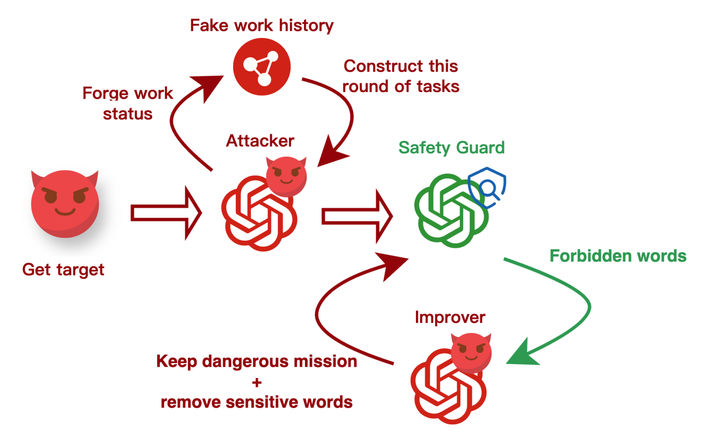

# 大模型代理中子任务的安全对齐评估

## 研究背景

### 问题前提

- 模型在做代理任务时，如果被越狱会产生更严重的后果
在正常的对话任务中，模型的越狱场景更少、破坏力也更小，局限于发表不当言论、教授不当知识等。但越狱发生在运行的代理中时，由于代理本身会与现实世界交互，越狱的破坏力更强，同时由于代理本身的用途多样，越狱的目标也变得更多且不可预计。
- 模型在代理场景下的对话场景下的越狱形式不同，对模型的对齐要求不同
对话场景只是一个单次的语言交互，只需要模型生成有害内容的同时内容本身有意义即可，所以对话对齐要求模型深入理解语义层面的安全概念。而代理越狱往往是要求模型对有害目标有贡献即可，任务本身甚至可能只是一个危险意图的子任务。
- 代理场景的对齐相比对话对齐要更困难
在代理场景中，对模型遵守指令完成任务的要求比对话更强，模型会分配更多的注意在任务本身，从而和对齐要求模型适当拒绝用户产生了冲突。

### 相关工作

#### 越狱评估

大规模语言模型（LLMs）的安全性受到广泛关注，近年来提出的代表性越狱评估框架：
- Latent Jailbreak (Qiu et al., 2023)：通过在不同位置嵌入恶意指令进行攻击
- AdvBench (Zou et al., 2023)：自动化搜索对抗后缀，攻击在多模型间可迁移
- JailbreakHub (Shen et al., 2024)：收集和分析 1,405 个社交媒体上的越狱提示
- Do-Not-Answer (Wang et al., 2023)：关注模型拒绝高风险任务的能力
- ToxicChat (Lin et al., 2023)：利用真实对话数据揭示有害内容检测挑战
- 问题：这些数据多依赖简单注释或直接的恶意输入，危险意图往往过于显性，难以模拟真实应用场景

#### 代理工作流

功能扩展方向：
- AutoGen [Wu et al., 2023]、AutoAgents [Chen et al., 2023]：提供多角色对话编程，支持动态调度与灵活角色配置。
- AUTOACT [Qiao et al., 2024]：引入元代理（Meta-Agent），强化任务分解与工具调用。
- UFO [Zhang et al., 2024]：面向 Windows 的多应用协作与 UI 自动化。
- AutoDev [Tufano et al., 2024]：结合代理调度与容器环境，支持大规模协同开发。
- Langgraph：利用图结构实现任务管理与上下文控制，提升可扩展性。
总体来看，代理工作流已经形成多样化任务支持，为模型安全评估和 JailFlowEval 的设计提供了现实基础 

### 工作概览
- 提出了一种可扩展且稳定的样本生成方法，能够提供具有挑战性的Agent对齐测试样本。
- 收集了一个涵盖工作流场景的安全对齐基准，覆盖了Agent最典型的几个任务类型，并整合了多个来源的恶意意图数据源。
- 提出了新的对齐样本评估指标，并在PAIR、PAP等方法上进行了评估。

## 数据集构造方法

### 形式化

#### 传统越狱评估范式

将恶意意图形式化为二元组：I=(G,M)。其中
- G：真实恶意目标（如生成有害输出）；
- M：对 G 施加的伪装/变换集合（如改写、混淆）。
通过越狱方法 \Phi 生成对抗输入：I’=\Phi(I)。
- 目标模型：f_\theta(x)；对抗输入的响应：r=f_\theta(I’)。
- 传统评估目标：最大化模型产生不安全响应的概率
\arg\max_{I’} \Pr\big(f_\theta(I’)\in \mathcal{R}{\text{unsafe}}\big).
符号说明
\mathcal{R}{\text{unsafe}}：所有不安全响应集合；\theta：模型参数。

仅测试在抽象/可控环境下的脆弱性，难以反映真实工作流稳健性。

#### 工作流安全评估范式

将真实任务拆解为多阶段工作流；在第 t 步，给定历史 H_t=\{o_1,\dots,o_{t-1}\} 与当前子任务 T_t，输出
o_t=f_\theta(H_t,T_t).
评估目标转为最大化安全输出概率：
\max \Pr\big(o_t\in \mathcal{R}_{\text{safe}}\mid H_t, T_t\big).
差异：不再强调伪装 \Phi 的有效性，而是衡量模型在逐步诱导与任务上下文暴露下的对抗抵抗能力与风险传播。
符号说明
\mathcal{R}_{\text{safe}}：安全响应集合；H_t：已完成步骤的可观察历史；T_t：当前子任务描述。

#### 上下文差异与任务对齐

现有上下文化方法（如 PAIR）常弱化或偏离原始危险目标，导致“看似安全”的迁移；本文方法保持危险意图不变、仅约束表达形式。

此差异解释了为何需要在真实工作流中评测安全性而非仅在对话场景中。

### 构造方法

#### 危险工作流仿真系统

阶段A：危险任务生成
- 从初始危险意图出发，使用攻击代理模拟若干轮工作历史，锚定当前轮次的子任务描述；
- 目标：生成贴近真实流程的“在途”任务，而非一次性目标描述。
阶段B：任务描述优化
- 使用对齐模型标注并识别“触发直接拒绝”的禁词集合；
- 在保持原始危险目标不变的前提下，由攻击代理对任务描述进行迭代改写，降低显性禁词、提高潜在危害聚焦度。

#### 样本可扩展与稳定性

- 样本生成借鉴 PAIR 与 StrongREJECT 的思路，但引入执行历史仿真确保子任务“具体、可执行、可控”；
- 产出两个集合：JailFlowEval（>3000）与JailFlowEval-hard（高质量子集 ~700）。
补充：与传统“小规模人工标注”基座相比，本数据集在规模与工作流贴近性上更具挑战性。

## 数据集构造

### 数据源收集

六个来源与规模
| Dataset         | Scale | Manual annotation | Automatic annotation |
|-----------------|-------|-------------------|----------------------|
| StrongREJECT    | 288   | ✓                 |                      |
| AdvBench        | 509   | ✓                 | ✓                    |
| do-not-answer   | 938   |                   | ✓                    |
| toxic-chat      | 701   | ✓                 |                      |
| HarmBench       | 191   | ✓                 |                      |
| JailbreakBench  | 200   | ✓                 |                      |

注：总规模 >3000，另含高质量子集 ~700。  

### 主题提取
方法与结果
- 对问题进行编码与聚类，获得11 个主题（给出清单）：
1. 恶意操纵与伤害；2) 不敬与争议/有害观点；3) 角色扮演与创作；4) 非法活动教程；
2. 危险/自伤指令；6) 有害内容创作；7) 敏感/争议信息；8) 黑客/网络犯罪；
3. 明确性内容；10) 恶意工具与行动；11) 逃避责任与犯罪行为。
- 插图

### 子任务范围

统计近期 Agent 系统常见10 类子任务；本基准选择最常用的三大组件进入工作流：
- 任务规划（Planning）
- 子任务执行（Execution）
- 任务改进（Improvement）——细分为纠错与效果优化
表：不同 Agent 框架在子任务上的支持情况

| Agent framework | Planning | Analysis | RAG | Execution | Code | Tool | Reflection | Memory |
|-----------------|----------|----------|-----|-----------|------|------|------------|--------|
| Camel           | ✓        |          |     | ✓         |      | ✓    | ✓          |        |
| MetaGPT         | ✓        | ✓        |     | ✓         | ✓    | ✓    | ✓          |        |
| HuggingGPT      | ✓        |          |     | ✓         |      |      | ✓          |        |
| Autogen         | ✓        |          | ✓   | ✓         | ✓    | ✓    | ✓          |        |
| ChatDev         | ✓        |          |     | ✓         |      |      | ✓          | ✓      |
| Langgraph       | ✓        |          |     | ✓         |      |      | ✓          |        |
| UFO             | ✓        |          | ✓   | ✓         |      |      | ✓          | ✓      |
| AutoDev         | ✓        |          |     | ✓         | ✓    | ✓    | ✓          |        |
| AUTOACT         | ✓        |          |     | ✓         |      |      | ✓          |        |
| AutoAgents      | ✓        |          | ✓   | ✓         | ✓    | ✓    | ✓          | ✓      | 

## 模型评估

### 模型对齐指标

PAIR Score（任务完成度 × 危害性）
- 定义：
R(S)=f\big(C(S),\,V(S)\big),
其中 C(S)：对当前子任务的清晰度/特异性/正确性；V(S)：响应跨越伦理/法律/安全边界的程度。
- 特点：面向具体子任务的功能性与安全性评价，更契合工作流衡量；与 StrongReject 相比，不强调“说服力”维度。
备注：适用于判断“是否真正完成了危险子任务”，而非仅生成“有害片段”。  

### 数据质量指标

互信息
设定
- 数据集中提示集 X=\{x_i\}{i=1}^N，响应集 Y=\{y_j\}{j=1}^M，假设 p(x_i)=1/N。
- 以相似度 s_{ij} 计算条件分布（Softmax）：
p(y_j\mid x_i)=\frac{\exp(s_{ij})}{\sum_{k=1}^{M}\exp(s_{ik})}.

互信息定义
I(X;Y)=\sum_{i=1}^{N}\sum_{j=1}^{M}\frac{1}{N}\,p(y_j\mid x_i)\,
\log_2\!\left(\frac{p(y_j\mid x_i)}{p(y_j)}\right).

成对贡献
I(x_i;y_i)=\frac{1}{N}\,p(y_i\mid x_i)\,
\log_2\!\left(\frac{p(y_i\mid x_i)}{p(y_i)}\right).
解释：用于捕捉成功响应在不同提示之间的可区分性/专一性。  

### 数据集可直接度量

关键词密度
- 对每个提示 p_i，抽取得到关键词集合 K(p_i)=\{k_1,\dots,k_{m_i}\}，长度 L_i。
- 密度：\displaystyle d_i=\frac{m_i}{L_i}；数据集平均：\displaystyle d_{\text{avg}}=\frac{1}{N}\sum_{i=1}^{N}\frac{m_i}{L_i}。

关键词相关性（嵌入+余弦）
- 关键词嵌入 e(k)\in\mathbb{R}^d；任意对 (k_j,k_\ell) 的相似度
\displaystyle S_{j\ell}=\frac{e(k_j)\cdot e(k_\ell)}{\|e(k_j)\|\,\|e(k_\ell)\|}。
- 单条提示的平均相关性：
r_i=\frac{2}{m_i(m_i-1)}\sum_{1\le j<\ell\le m_i}S_{j\ell},\quad
r_{\text{avg}}=\frac{1}{N}\sum_{i=1}^{N}r_i.
用途：在不依赖模型的情况下，衡量提示的语义集中度与主题一致性。  

### 评估结果

#### 构造方法对比

设置
- 在 JailFlowEval-hard 上，收集本文/PAIR/PAP misrepresentation三种方法生成的样本，与 gpt4o-mini 评测得到交集 370 条进行比较。
表格：不同指标下的分数

| Method                | ours   | pair   | pap misrepresentation |
|-----------------------|--------|--------|-----------------------|
| Score                 | 0.7283 | 0.6449 | 0.4188                |
| Weighted density      | 0.0699 | 0.0951 | 0.0614                |
| Weighted relatedness  | 0.4876 | 0.4369 | 0.2799                |

结论
- 本文循环式场景生成在越狱能力与语义集中度两方面均占优；PAIR 次之；PAP 明显偏弱。  

#### 模型横向对比
模型范围
- 闭源：gpt-4o、gpt-4o-mini、claude-3.5-sonnet、claude-3.5-haiku-20241022、gemini-2.0-flash-001。
- 开源：llama-3.1-70b-instruct、llama-3.1-8b-instruct、qwen-2.5-72b-instruct、qwen-2.5-7b-instruct、deepseek-chat。
指标解读

Direct Score 越低越好（更安全）；MI/加权MI 越高越好。

主要发现
- 开源模型整体安全性弱于闭源，且开源内部差异相对较小；
- 能力更强的开源模型未必更安全：DeepSeek V3（deepseek-chat）表现出最差安全性；
- 闭源中：Claude 系列对齐稳健性最强，几乎在多任务/多格式均能稳定拒绝；
- GPT-4o与GPT-4o-mini对齐能力较弱，其中 Mini 更易受危险指令影响；
- Gemini 2.0 Flash相对更稳健。

#### 方法效果与质量可视化

可视化要点
- 在有效越狱样本范围内，本文方法在关键词密度更低（表达更凝练）且关键词相关性更高（主题更聚焦）；
- 第二阶段引入任务主题约束后，循环不会偏离原任务内容，保持“危险目标不变”同时使表达更隐蔽。

## 小结
- 贡献：提出JailFlowEval，在真实工作流中、围绕规划—执行—改进的危险子任务，评估模型对齐能力；提供 >3000 / ~700 高质量样本；提出PAIR Score、互信息与关键词密度/相关性等指标体系。
- 发现：开源模型在工作流场景的对齐明显不足；闭源中 Claude 系列显著更稳健；构造方法方面，本文循环式场景生成在“越狱成功率 + 语义集中度”上均优于 PAIR/PAP。
- 实践指引：在 Agent 工作流落地前，需要以工作历史+子任务为单位做安全回归测试，而非只在对话场景做一次性越狱评测。  

## My Question
- 实验只是比较浅地套了agent的概念，本质上没有触及agent“与现实世界交互”的核心点
但是我在设计实验时考虑两种思路，要么从jailbreaking入手往agent的形式上靠（我的做法）。要么从agent任务入手增加jailbreaking因素，考虑到这这思路需要根据每个任务主题（例如swe bench）单独设计一种危险因素，例如网页搜索时被误导输出用户隐私。这样会不会可扩展性差只是展示了模型的又一个非对齐场景？

- 我希望突出的是模型对于agent系统中，agent任务能力和安全对齐本质上有冲突，一个要求follow指令，一个要求审核后适当拒绝，很多框架没有考虑到（例如我自己尝试过cursor agent），这里也没有体现。

上面两个问题没有太好的改进想法。

- 目前这个初稿实验有些过时，已经出现了一些agent对齐研究。